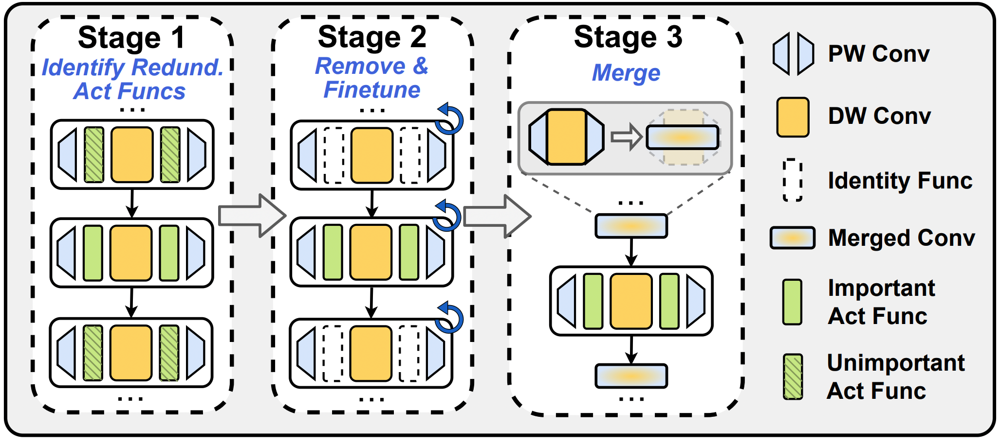
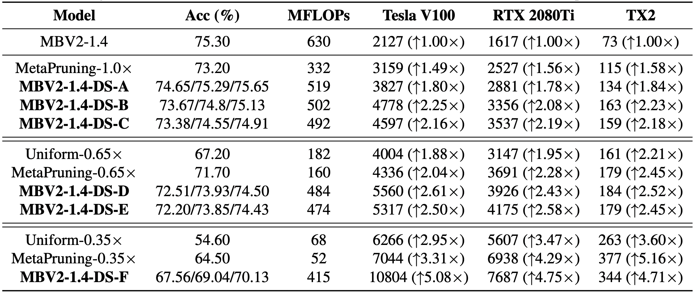

# DepthShrinker: A New Compression Paradigm Towards Boosting Real-Hardware Efficiency of Compact Neural Networks
Yonggan Fu, Haichuan Yang, Jiayi Yuan, Meng Li, Cheng Wan, Raghuraman Krishnamoorthi, Vikas Chandra, Yingyan Lin

Accepted at ICML 2022 [[Paper Link]](https://arxiv.org/pdf/2206.00843.pdf).


## DepthShrinker: Overview
- To tackle the dilemma between *the low hardware utilization of existing efficient DNNs* and *the continuously increasing degree of computing parallelism of modern computing platforms*, we propose a framework dubbed ***DepthShrinker***, which develops hardware-friendly compact networks via shrinking the basic building blocks of existing efficient DNNs that feature irregular computation patterns into dense ones with much improved hardware utilization and thus real-hardware efficiency.

- **Key idea**: Shrink consecutive operations, between which the non-linear functions are properly removed, into one single dense operation.
<p align="center">
  
</p>


## DepthShrinker: Framework
- To identify which activation functions to remove and restore the accuracy after the removal, we implement DepthShrinker as a three-stage framework:

<p align="center">
  
</p>

## DepthShrinker: Experimental Results
- DepthShrinker delivers compact DNNs that outperform both SOTA channel-/layer-wise pruning techniques, e.g., a 3.06% higher accuracy and 1.53×
throughput on a Tesla V100 GPU over SOTA channel-wise pruning method MetaPruning.

<p align="center">
  
</p>


## Code Usage

Configurations for training/evaluation are set in `config/{config-file}.yaml` and some arguments can also be overrided via `argparse` in the `main.py`. For example, `DS.SEARCH` in the config file serves as a flag to switch between the two stages of identifying redundant activation functions and finetuning the network after the removel.


### Evaluate Pretrained Models of DepthShrinker

- To evaluate the accuracy of a pretrained model on ImageNet:
```
python main.py --cfg configs/{config-file}.yaml \
        --data_path {path-to-imagenet} \
        --batch-size 128 \
        --pretrain {path-to-pretrained-ckpt} \
        --eval \
        --dp 
```


- To measure the throughput of a model after shrinking:
```
python main.py --cfg configs/{config-file}.yaml \
        --data_path {path-to-imagenet} \
        --batch-size 128 \
        --pretrain {path-to-pretrained-ckpt} \
        --throughput \
        --dp 
```

Our pretrained models (at the last epoch) on MobileNetV2-1.4 are available [here](https://drive.google.com/drive/folders/1VJzub3-vL0hH8pP18FjYmhVNSY-X5JIA?usp=sharing).


### Train with DepthShrinker from Scratch

- *Stage 1*: To search for redundant activaton functions, set `DS.SEARCH=True` and the target remaining ratio of activation functions via `DS.L0_SPARSITY` in the config file `configs/{config-file}.yaml` (optionally start from a pretrained model via setting `DS.PRETRAINED`). Next start the search process: 
```
python main.py --cfg configs/{config-file}.yaml \
        --data_path {path-to-imagenet} \
        --batch-size 256
```

- *Stage 2*: To finetune the resulting network in the stage 1, set `DS.SEARCH=False`, `DS.ACT_FROM_SEARCH=True`, and config `DS.SEARCH_CKPT` as the path to the checkpoint from the stage 1 (optionally enable self-distillation via setting `DS.DISTILL`), then run the above training command again.


## Citation
```
@article{fu2022depthshrinker,
  title={DepthShrinker: A New Compression Paradigm Towards Boosting Real-Hardware Efficiency of Compact Neural Networks},
  author={Fu, Yonggan and Yang, Haichuan and Yuan, Jiayi and Li, Meng and Wan, Cheng and Krishnamoorthi, Raghuraman and Chandra, Vikas and Lin, Yingyan},
  journal={arXiv preprint arXiv:2206.00843},
  year={2022}
}
```

## License
The majority of DepthShrinker is licensed under CC-BY-NC, however portions of the project are available under separate license terms: pytorch-image-models (Timm) is licensed under the Apache 2.0 license; Swin-Transformer is licensed under the MIT license.

## Contributing
We actively welcome your pull requests! Please see [CONTRIBUTING](CONTRIBUTING.md) and [CODE_OF_CONDUCT](CODE_OF_CONDUCT.md) for more info.


